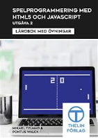

# spelprogrammering.nu med HTML5 och JavaScript - Utgåva 2, 2013

Det här "repository" innehåller kodexempel och lösningsförslag till läroboken med övningar.
Egna exempel och övningar från boken, utgiven av Thelin Läromedel

Utgiven av Thelin Läromedel - [www.skolportalen.se](https://www.skolportalen.se "Öppna skolportalens sida")  
Författare: Mikael Tylmad & Pontus Walck

Tanken är att ni som använder läromedlet ska kunna komma hit och studera, ladda hem och testa mina lösningsförslag.
Materialet är ej färdigställt.

_Av respekt till författare och upphovsrättsliga lagar så har jag medvetet ändrat 
kodexemplen från boken. Detta i sin tur ger dig som läsare fler infallsvinklar och 
exempel på hur man kan lösa något._

Senast uppdaterad 2020-12-28

Niklas Engvall.  
Borlänge   

## Innehållsförteckning 

  :heavy_minus_sign: = Ingen källkod finns till avsnittet 
  :white_check_mark: = Kodexempel/övningar finns till kapitlet/avsnittet men är ej slutfört 
  :heavy_check_mark: = Alla kodexempel/övningar till kapitlet/avsnittet är färdigställda  
  [TOMT] = Ej påbörjat kapitel

### Läroboken

| Kapitel | Avsnitt                                              |  Sida  |   Status  |
| :-----: | ---------------------------------------------------- | :----: | :-------: |
|    1    | JavaScript och grafik                                |     1  | :white_check_mark: |
  
  
### Uppgifter

| Kapitel | Uppgifter                                            |  Sida  |   Status  |
| :-----: | ---------------------------------------------------- | :----: | :-------: |
|    1    | 1.1 Rita former med JavaScript                       |    12  |           |
